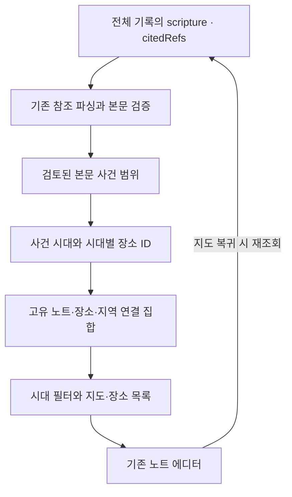
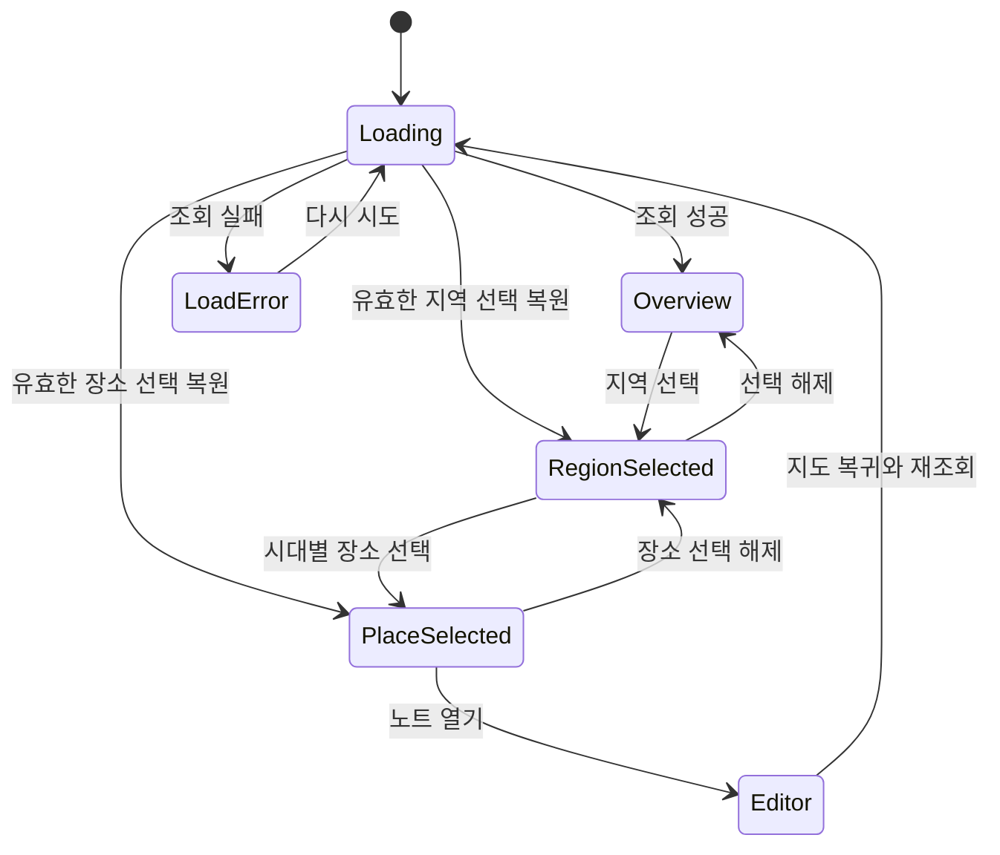

# 말씀 지도 V1 - Plan

## Goal Capsule

- **Objective:** 사용자가 자신이 남긴 설교 노트를 성경 사건의 장소와 시대를 따라 다시 찾으며 기록의 의미를 느낀다.
- **Means:** 검증한 본문·시대·장소 연결표와 기기에 포함한 지도로 기록을 연결한다(KTD1).
- **Authority:** 이번 대화에서 선택한 범위 → 이 문서의 Product Contract → Planning Contract. 현재 앱 동작은 코드와 wiki가 기준이다.
- **Deliverables:** 이 설계와 별도의 [Claude Design 브리프](../design/2026-10-09-scripture-map-v1-claude-design-brief.md). 이번 작업은 문서 작성까지이며 앱 구현·출시는 포함하지 않는다.
- **Stop condition:** 지도·본문·시대의 근거를 확인할 수 없는 항목은 출시 데이터에 넣지 않는다. 시안에는 검토 후보임을 표시한다.

---

## Product Contract

### Summary

말씀 지도는 저장된 설교 본문과 인용 구절을 검증된 사건 배경에 연결하는 별도 화면이다.
장소의 위치와 이름은 시대별로 구분하며, 장소를 선택하면 관련 기록을 다시 읽을 수 있다.

### Problem Frame

사용자는 설교 노트를 쓰는 행위에 의미가 쌓이기를 원한다.
기록 횟수와 보상만으로는 어떤 말씀을 남겼는지 돌아보기 어렵다.
기존 앱의 절제된 디자인과 오프라인 사용을 유지하고, 사용자 확보 전에 성경 판본 라이선스나 반복 API 비용을 부담하지 않는 것이 이번 선택의 배경이다.

### Key Decisions

- **지도에 기록의 맥락을 쌓는다.** 현대적인 표현과 성경 배경 이해를 함께 추구한다. Governs R1, R7. (session-settled: user-approved — chosen over 무화과나무 성장 화면: 모던한 UI와 기록의 의미를 함께 유지)
- **첫 버전은 검증한 본문만 연결한다.** 자유로운 글 전체를 분석하는 방식의 비용과 오류 부담을 줄인다. Governs R2, R3. (session-settled: user-approved — chosen over 모든 노트의 AI 분석: 비용 없이 작은 범위에서 핵심 경험 검증)
- **시대에 따른 장소 변화를 표현한다.** 같은 지역을 하나의 영구적인 장소로 취급하지 않는다. Governs R4, R5. (session-settled: user-directed — chosen over 지명별 단일 좌표: 같은 지역에도 시대별 다른 장소가 존재)

### Requirements

**기록 연결**

- R1. 노트 목록과 태블릿 노트 사이드바에서 별도 말씀 지도 화면을 열 수 있다.
- R2. 연결 입력은 저장된 `scripture`와 `citedRefs`이며, 지원하는 참조를 본문과 대조한 뒤 검증된 사건 범위와 연결한다.
- R3. 본문의 지명 언급을 사건 배경으로 간주하지 않는다. 미지원·불확실·상징적 장소에는 추측 표식을 만들지 않는다.
- R6. 장소별 목록에서 실제 노트를 열고, 돌아오면 시대 필터와 선택한 지역을 유지하면서 저장된 변경을 반영한다.

**시대와 장소**

- R4. 지도에 연결되는 장소는 시대별로 독립 식별한다. 같은 지역의 다른 위치와 같은 위치의 다른 이름·장소를 모두 표현할 수 있다.
- R5. 시대 기준은 본문 속 사건이며 노트 작성일이나 성경 책의 저작 시기가 아니다. 전체 보기와 시대 선택을 제공하고 불명확한 시대는 ‘시대 미상’으로 표시한다.
- R8. 같은 화면 위치에 표식이 겹치면 지역 묶음으로 선택할 수 있다. 상세에서 시대별 장소를 구분하며, 좌표가 같은 장소를 구분하려고 실제 위치를 옮기지 않는다.
- R9. 요약의 기록 수는 고유 노트 ID, 지역 수는 지역 묶음으로 계산한다. 시대 필터 후에도 해당 집합에서 중복을 제거한다.

**디자인과 데이터**

- R7. 기존 테마·폰트·여백을 사용하며 나무·게임 재화·연속 기록 압박을 추가하지 않는다. 지도 표식과 동일한 장소 목록을 제공한다.
- R10. 지도와 연결은 설치 후 오프라인으로 작동한다. 노트·본문·선택한 시대를 외부로 전송하지 않는다.
- R11. 전체 저장 기록을 대상으로 연결하며 최근 목록의 200편 제한을 지도에 적용하지 않는다.
- R12. 지도 데이터의 출처·이용 조건·수정 여부와 위치의 불확실성을 앱에서 확인할 수 있다.

### Key Flows

- F1. 노트 작성·저장 → 목록에서 말씀 지도 진입 → 연결 가능한 기록으로 지도 구성 → 지역 선택 → 시대별 장소와 관련 노트 확인 → 기존 에디터에서 노트 열기. Covers R1, R2, R6.
- F2. 전체 시대 지도 → 시대 선택 → 해당 시대의 장소·기록만 표시 → 전체로 복귀. Covers R4, R5, R9.
- F3. 같은 지역에 여러 시대의 장소가 겹침 → 지역 묶음 선택 → 시대별 장소 선택 → 해당 장소의 위치와 기록 확인. Covers R4, R8.

### Acceptance Examples

| ID | 입력·행동 | 기대 결과 |
|---|---|---|
| AE1 | 한 노트의 설교 본문과 두 인용이 같은 사건·장소와 연결 | 장소 목록에 한 편만 표시 |
| AE2 | 한 노트에 여호수아 시대와 예수님 사역 시대의 여리고 본문을 함께 인용 | 시대별 장소에는 각각 연결되며 전체 기록 수는 한 편 |
| AE3 | 같은 이름·지역의 두 시대 장소에 다른 좌표가 있음 | 각 위치를 유지하고, 축척상 겹칠 때 지역 묶음으로 선택 가능 |
| AE4 | 같은 좌표에 다른 시대의 성전이 연결 | 위치를 이동시키지 않고 상세의 시대별 항목으로 구분 |
| AE5 | 본문은 유효하지만 연결표에 없거나 지리 위치를 확인할 수 없음 | 노트는 유지되고 표식을 만들지 않음 |
| AE6 | 201번째 이후의 오래된 노트만 지도에 연결 가능 | 오래된 기록도 지도와 관련 목록에 포함 |
| AE7 | 비행기 모드에서 지도·시대 필터·기존 노트 열기 | 핵심 흐름 정상 동작 |
| AE8 | 선택한 장소의 마지막 노트를 삭제한 뒤 지도 복귀 | 해당 연결을 제거하고 유효하지 않은 선택을 해제 |

### Scope Boundaries

첫 버전은 검증한 소수의 사건과 시대를 대상으로 한다.
사용자가 지도 전체를 완성하도록 요구하지 않으며, 연결되지 않은 기록을 낮게 평가하지 않는다.

이번 범위에서 제외하는 것은 자유 글 AI 분석, 정확한 기원전·후 연도 슬라이더, 국가·왕국 경계 재현, 이동 경로, GPS, 외부 지도 타일, 새로운 성경 판본, 유료화·광고·지도 내보내기다.
연도 슬라이더와 경계 복원은 정밀한 연대·지형 데이터가 검증될 때 별도 검토한다.
시대별 데이터 모델을 위해 범용 역사 GIS나 데이터 관리 서버를 만들지 않는다.

---

## Planning Contract

### Assumptions

다음은 설계 기본안이며 사용자가 별도로 선택한 세부 사양은 아니다.

- 최초 지도 범위는 갈릴리·예루살렘·여리고 주변으로 제한한다.
- 최초 시대 이름은 ‘여호수아 시대’, ‘왕국 시대’, ‘예수님 사역 시대’다. 이 이름은 본문 사건을 분류하는 넓은 맥락이며 고고학적 연대를 확정하는 표현이 아니다.
- 아래 후보 다섯 사건으로 데이터 검토를 시작한다. 실제 좌표·본문 범위·시대 출처를 확인한 항목만 수록한다.
- ‘기록에 의미가 생겼다’는 가치는 초기 사용자 인터뷰로 확인한다. 재방문율·매출 개선은 아직 검증되지 않았다.

### Key Technical Decisions

- KTD1. **기기에 포함한 연결표와 순수 매칭.** R2, R3, R10을 구현한다. 기존 `parseRef`, `lookupVerses`, `formatRef`를 사용하고 책 코드로 외부 데이터의 표기 차이를 흡수한다. 일반 문단의 자유 글 분석은 하지 않는다.
- KTD2. **시대별 장소 항목을 직접 참조.** R4, R5를 구현한다. 사건은 지역 이름이나 현재 도시 좌표가 아니라 검토한 시대별 장소 ID에 연결한다. 같은 지역 묶음 안에 다른 장소·좌표를 둘 수 있고, 동일한 도시가 이어졌는지 검증되지 않은 경우에도 병합하지 않아도 된다.
- KTD3. **가벼운 전체 기록 조회.** R11을 구현한다. NoteRepo에 지도용 읽기 전용 조회를 추가해 ID·제목·설교 본문·인용 참조·날짜만 가져온다. 화면에 SQL을 넣지 않으며 지도 연결을 노트에 저장하지 않아 DB 컬럼·마이그레이션은 필요 없다.
- KTD4. **로컬 벡터 지도.** R7, R8, R10을 구현한다. 이미 설치된 `react-native-svg`를 사용해 지형과 표식을 표현한다. 전체 지도와 선택 지역의 확대 도식에서 같은 지도 구성 요소를 재사용하며, 첫 버전에는 자유 이동·핀치 줌을 추가하지 않는다.
- KTD5. **기존 노트 라우트와 저장 흐름 재사용.** R1, R6을 구현한다. 폰과 태블릿 모두 지도에서 `/note/[id]`를 열어 같은 편집·삭제 기능을 쓴다. 태블릿 지도는 가로로 조립하지만 기존 작업 공간에 새 네 번째 패널을 추가하지 않는다.
- KTD6. **출처가 분리된 지형과 장소 데이터.** R12를 구현한다. OpenBible의 CC BY 4.0 장소 메타데이터와 Natural Earth의 공개 영역 지형을 후보로 사용한다. OpenBible의 사진·OSM 도형은 가져오지 않는다. 한국어 성경 본문(CC BY-SA 4.0)과 지리 데이터의 라이선스를 별도로 고지한다.

### High-Level Technical Design

다음은 책임과 관계를 설명하는 설계이며 구현 코드나 확정된 함수 서명이 아니다.

**필요한 데이터는 세 종류다.** 지역은 묶음 키와 표시 이름만으로 충분하며 별도 범용 지역 계층을 만들 필요는 없다.

| 데이터 | 최소 정보 | 의미 |
|---|---|---|
| 시대 | ID, 한국어 이름, 표시 순서, 근거 | 사건 맥락. 절대 연도는 근거가 있을 때만 추가 |
| 시대별 장소 | ID, 지역 묶음 키·이름, 시대 ID, 당시 이름, 위치, 위치 설명·불확실성, 출처 | `jericho-conquest`와 `jericho-ministry`는 다른 항목 |
| 본문 사건 | ID, 책 코드·장·시작절·끝절, 사건 시대 ID, 연결할 시대별 장소 ID들, 배경 검증 근거 | 단순 지명 언급과 사건 배경의 차이를 담당 |

장소 위치는 정확한 건물 자리를 뜻하지 않는다.
유적·도시·주변 지역 중 어느 수준을 가리키는지 위치 설명에 명시한다.
시대를 확정할 수 없지만 장소 배경은 검증된 항목은 시대 미상으로 별도 수록할 수 있다.

**매칭 규칙**

1. 설교 본문과 인용 참조를 같은 책 코드·장·절 구간으로 정규화한다. 현재 지원 문법은 한 장 안의 절·절 범위다.
2. 본문 조회에 실패하거나 역방향 범위이면 연결에서 제외한다. ‘누가복음 19장’이나 복수 책·교차 장의 자유 형식을 새로 해석하지 않는다.
3. 유효한 구간과 같은 책·장의 검토된 사건 범위가 겹치면 해당 사건에 연결한다. 한 장 전체에 장소를 일괄 전파하지 않는다.
4. 넓은 인용에 여러 사건이 겹치면 각각 연결하고, 목록에는 원래 인용과 실제로 겹친 부분을 함께 표시한다.
5. 노트 ID와 시대별 장소 ID의 쌍으로 중복을 제거한다. 같은 지역의 서로 다른 시대 장소는 합치지 않는다.

현재 `parseRef`는 의미 검증을 하지 않으므로 파싱만으로 연결하지 않는다([성경 참조 규칙](../../wiki/rules/scripture-ref.md)).
`Note.location`은 설교 메타데이터이며 성경 지리 좌표의 입력으로 쓰지 않는다.

**시대별 표식**

- 시대 필터에는 설치된 데이터의 시대를 제공한다. ‘시대 미상’은 그런 항목이 있을 때만 표시한다.
- 전체 보기에서는 시대 이름을 상세·목록에 항상 함께 표기한다. 색만으로 시대를 구분하지 않는다.
- 좌표가 다르면 다른 표식으로 유지한다. 화면상 선택 영역이 겹치면 지역 묶음으로 표시하고 확대 도식과 장소 목록으로 선택한다.
- 좌표가 같으면 하나의 묶음 표식과 시대별 목록을 사용한다. 역사적 차이를 표현하려고 좌표를 임의 이동하지 않는다.
- 기하학적 표시와 겹침 판정은 폰·태블릿에서 같은 모델을 사용하고 실제 화면 좌표에서 판단한다.

### Seed Data Candidates

아래는 시안과 데이터 검토를 위한 후보다. 출시용 연결표와 좌표는 아직 만들어지지 않았다.

| 본문 후보 | 배경 후보 | 사건 시대 | 검토할 핵심 |
|---|---|---|---|
| 여호수아 6:1-20 | 여리고의 구약 장소 | 여호수아 시대 | 사건 맥락과 유적 위치를 구분 |
| 누가복음 19:1-10 | 여리고의 신약 장소 | 예수님 사역 시대 | 구약 장소와 다른 위치 후보 확인 |
| 역대하 3:1-17 | 예루살렘 성전 | 왕국 시대 | 도시와 성전 위치의 정밀도를 구분 |
| 누가복음 19:45-48 | 예루살렘 성전 | 예수님 사역 시대 | 이전 성전과의 장소 관계·주변 문맥 확인 |
| 마가복음 2:1-12 | 가버나움 | 예수님 사역 시대 | 도시 배경과 개별 집 위치를 구분 |

OpenBible은 [여리고 1](https://www.openbible.info/geo/ancient/a231f80/jericho-1)을 Tell es Sultan에 연결하고, [Tell el Alayiq](https://www.openbible.info/geo/modern/mdf4652/tell-el-alayiq)은 여리고 2와 연결한다.
이는 시대별 장소를 분리할 필요의 근거이며, 그 자체로 사건의 정확한 연대나 개별 장면의 위치를 증명하지 않는다.
특히 [여리고 1 페이지](https://www.openbible.info/geo/ancient/a231f80/jericho-1)에는 히브리서의 참조도 있다. ‘신약 책 → 신약 장소’라는 규칙을 사용하면 안 된다.

### Lifecycle and Integration

지도는 저장된 기록으로 파생되는 읽기 화면이다.
진입·복귀·삭제 취소 알림 때 다시 조회하고, 이전 비동기 조회가 새 결과를 덮지 않게 기존 포커스·정리 패턴을 따른다.
선택 장소가 사라지면 선택을 해제하고 지역 목록으로 돌아간다.

태블릿 사이드바에서 지도 라우트로 이동하기 전에는 `useNoteDraft`의 저장 완료를 기다린다.
저장 실패 시 현재 편집 화면에 남고 기존 오류 표현을 사용한다.
지도에서 연 에디터는 복귀 목적지가 말씀 지도임을 헤더에 표시한다.
에디터의 버튼·기기 뒤로·뒤로 제스처로 지도에 복귀할 때도 저장 완료를 기다린다.
현재 자동저장은 화면을 떠날 때 대기 타이머를 취소하므로, 단순히 기존 뒤로 동작만 재사용하면 마지막 입력이 지도에 반영되지 않을 수 있다.
삭제 후 복귀에는 삭제한 노트를 다시 저장하지 않는다.
지도에서 태블릿의 기존 단독 노트 라우트를 여는 선택은 ‘지도로 돌아오기’ 맥락을 유지하기 위한 것이며 폰·태블릿의 기능 차이를 만들지 않는다.

빈 기록과 연결되지 않은 기록은 성공 상태의 빈 결과로 표현하며 조회 실패와 구분한다.
조회 중에는 ‘연결된 기록 0편’을 먼저 확정해서 보여주지 않는다.

---

## Implementation Units

### U1. 사건·시대·장소 데이터와 연결 모델

**Goal:** R2–R5, R9를 만족하는 검증된 연결을 구성한다.
**Dependencies:** 없음. 후보 데이터 검토는 이 단위의 작업이다.
**Files:** 신규 `apps/ch-life/src/entities/scripture-map/{index.ts,model/types.ts,model/match-notes.ts,api/places.json,api/periods.json,api/scenes.json}`; 신규 `apps/ch-life/src/entities/scripture-map/model/__tests__/match-notes.test.ts`.
**Approach:** KTD1, KTD2를 적용한다. 기존 scripture 엔티티의 공개 참조 API를 재사용하며, 참조 문법 확장이나 기존 에디터 변경은 하지 않는다.
**Test scenarios:**

- Covers AE1. 서로 다른 표기의 동일 구절·중복 인용이 한 노트·장소 연결로 모인다.
- Covers AE2. 같은 노트의 두 시대 사건이 각 장소에 남고 전체 기록 수는 한 편이다.
- 유효한 범위가 사건 범위의 시작·끝에 걸치면 겹친 사건만 연결한다.
- Covers AE5. 역방향·없는 절·자유 문장·미지원 본문에는 연결이 없다.
- 히브리서처럼 이전 시대를 언급하는 본문은 책의 분류 대신 사건 시대를 따른다.
- 데이터에 없는 시대·장소 ID, 비정상 좌표, 본문 범위는 데이터 검증에서 발견된다.

**Verification:** 후보마다 배경·시대·좌표 출처를 검토하고 위 매칭 사례를 통과한다.

### U2. 전체 기록 조회와 지도 데이터 갱신

**Goal:** R6, R11을 만족하며 기존 저장·가져오기·삭제를 유지한다.
**Dependencies:** U1.
**Files:** 수정 `apps/ch-life/src/entities/note/model/note-repo.ts`, `apps/ch-life/src/entities/note/api/sqlite-note-repo.ts`, `apps/ch-life/src/entities/note/index.ts`, `apps/ch-life/src/entities/note/api/__tests__/note-repo.test.ts`; 신규 `apps/ch-life/src/pages/scripture-map/model/useScriptureMap.ts`.
**Approach:** KTD3에 따라 작은 필드 투영으로 전체 기록을 조회한다. 새 NoteRepo 함수를 요구하는 테스트 대역과 호출자는 함께 조정한다.
**Patterns:** 기존 NoteRepoProvider, `useFocusEffect`, 노트 삭제 상태의 `noteRevision`.
**Test scenarios:**

- Covers AE6. 201편 이상을 저장하고 가장 오래된 연결 기록도 조회한다.
- 가져온 노트가 기존 저장 노트와 같은 매칭 경로를 따른다.
- Covers AE8. 삭제·복원 후 장소 목록과 고유 기록 수가 맞는다.
- 포커스 재조회와 이전 조회가 역순 완료돼도 최신 결과를 유지한다.
- 조회 실패 시 빈 지도로 숨기지 않고 다시 시도를 제공한다.

**Verification:** 조회는 기존 schema를 사용하고 노트 원문·날짜·인용 스냅샷을 수정하지 않는다.

### U3. 지도·시대 필터·관련 노트 화면

**Goal:** R1, R4–R10에 해당하는 화면과 재방문 흐름을 제공한다.
**Dependencies:** U1, U2, 검토한 로컬 지형.
**Files:** 신규 `apps/ch-life/src/app/scripture-map.tsx`, `apps/ch-life/src/pages/scripture-map/{index.ts,ui/ScriptureMapPage.tsx}`, `apps/ch-life/src/widgets/scripture-map/{index.ts,ui/ScriptureMap.tsx,model/marker-layout.ts,model/__tests__/marker-layout.test.ts}`, `apps/ch-life/assets/maps/scripture-region.json`; 수정 `apps/ch-life/src/pages/notes/ui/NotesPage.tsx`, `apps/ch-life/src/pages/notes/ui/NoteListSidebar.tsx`, `apps/ch-life/src/pages/notes/ui/TabletWorkspace.tsx`, `apps/ch-life/src/pages/note-editor/ui/NoteEditorPage.tsx`.
**Approach:** KTD4, KTD5와 디자인 브리프를 따른다. 지도 선택과 장소 목록 선택은 같은 상태를 갱신한다. 지역 확대는 로컬 벡터의 선택 영역 표현이며 별도 지도 SDK를 추가하지 않는다.
**Patterns:** AppHeader, HeaderBack, 기존 노트 행 표현, ThemeProvider, TABLET_BREAKPOINT.
**Test scenarios:**

- Covers AE3, AE4. 다른 좌표·같은 좌표·좁은 화면에서의 겹침을 각각 구분한다.
- 시대 필터 변경 시 요약과 목록이 함께 갱신되고 숨겨진 선택은 해제된다.
- 지도 표식을 누르지 않고 장소 목록만으로 같은 기록을 열 수 있다.
- 노트 열기·지도 복귀 시 선택과 필터가 유지되며 편집 결과를 재조회한다.
- 입력 후 자동저장 지연이 끝나기 전에 버튼·기기 뒤로·제스처로 복귀해도 마지막 구절이 저장된다. 실패 시 에디터에 남고 삭제 후에는 저장하지 않는다.
- 태블릿의 저장 성공 후만 지도에 진입하고 실패하면 현재 편집을 유지한다.
- 빈 상태·로딩·조회 실패의 문구와 동작이 서로 다르다.

**Verification:** 표식 배치·집계는 순수 모델 테스트로 검증한다. 기존 저장소에는 RN 화면 테스트 도구가 없으므로 화면·훅·내비게이션은 비행기 모드의 폰·태블릿에서 F1–F3과 위 시나리오를 수동 확인한다. 이 기능을 위해 별도 UI 테스트 프레임워크를 도입하지 않는다.

### U4. 출처 고지와 현재 동작 문서

**Goal:** R12 및 저장소의 동작 문서 규칙을 만족한다.
**Dependencies:** U1–U3.
**Files:** 수정 `apps/ch-life/src/pages/licenses/ui/LicensesPage.tsx`, `wiki/contracts/CONTRACT-NOTE-REPO.md`, `wiki/rules/layout-a11y.md`, `wiki/policy/POL-LICENSE.md`, `wiki/by-task.md`; 신규 `wiki/rules/scripture-map.md`.
**Approach:** 실제 수록 데이터의 라이선스·원출처·한국어 이름 및 간소화 변경 내역을 고지한다. 새 조회 계약과 지도 규칙은 구현과 같은 변경에서 문서화한다.
**Test expectation:** 문서·고지 자체는 수동 검증. 링크와 표시 내용을 실제 번들 출처와 대조한다.
**Verification:** 오프라인에서도 고지 본문을 읽을 수 있고 기존 성경 본문 고지가 유지된다.

---

## Verification Contract

| 대상 | 완료 증거 |
|---|---|
| 순수 연결 | U1의 매칭·데이터 무결성 시나리오 |
| 저장소 | U2의 전체 조회·기존 DB·가져오기·삭제 복원 시나리오 |
| 화면 | U3의 시대별 장소와 선택·복귀 시나리오 |
| 기기 | 비행기 모드, 폰·태블릿, 동일 좌표 겹침, 큰 글자, 스크린리더 |
| 테마 | focus·dark 주요 화면, minimal·paper 토큰 적용 확인 |
| 앱 구현 후 | 앱 디렉터리에서 `pnpm typecheck`, `pnpm lint`, `pnpm test:ci` |
| wiki 수정 후 | 저장소 루트에서 `node wiki/check.mjs` |
| 이번 문서 작성 | 내부 링크, 요구사항·시안 일치, `git diff --check` |

이번 작업에서는 앱 테스트를 실행하지 않는다.
실제 기기에서 지도 성능·터치·네트워크 경로는 구현 단계에서 검증한다.

---

## Definition of Done

- 설계와 독립적인 Claude Design 브리프가 같은 범위·시대·집계 규칙을 설명한다.
- 구현 완료 시 U1–U4의 검증과 AE1–AE8이 충족된다.
- 장소 좌표와 사건 시대의 출처가 준비되지 않은 후보는 출시 데이터로 표시하지 않는다.
- 기존 노트 저장·편집·가져오기·내보내기·삭제 취소가 유지된다.
- 사용자 콘텐츠가 외부로 나가는 새 경로가 없고 로컬 지도에 별도 API 요금이 없다.
- 실험 중 버린 코드·새 의존성·사용하지 않는 데이터가 최종 변경에 남지 않는다.

---

## Sources

- [독립 디자인 브리프](../design/2026-10-09-scripture-map-v1-claude-design-brief.md)
- [사용자 제공 Claude Design 프로젝트와 가져오기 조건](../design/2026-10-09-scripture-map-claude-project.md): 원격 파일 확인은 OAuth 인증 갱신 후 진행한다. 실제 시안과 설계의 대응은 아직 검증하지 않았다.
- [기존 사업 기능 조사](../research/2026-10-08-business-feature-opportunities.md)
- [사용자 제공 성경 시대·지역 개요 원본](../research/source/bible_timeline_by_period_and_region.md), [작성 경위와 검증 상태](../research/source/README.md): GPT 생성 참고 자료이며 V1의 검증된 연결표나 지원 범위로 간주하지 않는다.
- [개인정보 정책](../../wiki/policy/POL-PRIVACY.md), [성경 본문 라이선스](../../wiki/policy/POL-LICENSE.md), [NoteRepo 계약](../../wiki/contracts/CONTRACT-NOTE-REPO.md)
- [OpenBible 지리 데이터와 이용 조건](https://github.com/openbibleinfo/Bible-Geocoding-Data/blob/main/readme.md): 장소 후보와 구절별 언급을 제공하며 사건 시대 연결표는 별도로 검토해야 한다.
- [Natural Earth 이용 조건](https://www.naturalearthdata.com/about/terms-of-use/): 기본 지형 후보다. 고대 경계나 당시 해안선을 복원한 자료는 아니다.
